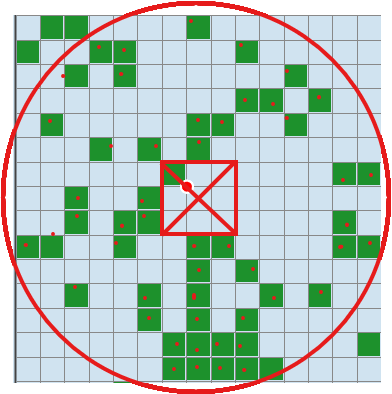
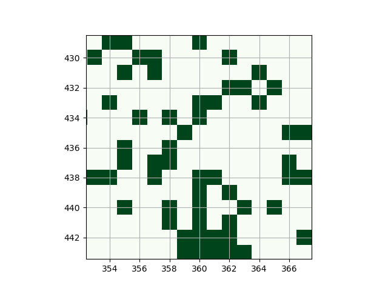

计算 Minecraft 指定区域中的史莱姆区块数量(找出尽可能大的的史莱姆农场)

## 效果

史莱姆区块数: 50, 种子: 2772304346537327921, 挂机点区块位置: (360, 436)

[Chunkbase.com:](https://www.chunkbase.com/apps/slime-finder#seed=2772304346537327921&platform=java&x=5760&z=6976&zoom=1.2)



get_chunk_map.py:



## 用法

1. 克隆存储库

```shell
git clone https://github.com/dunxuan/SlimeChunkCounter.git
cd SlimeChunkCounter
```

2. 创建 Conda 环境

```shell
conda env create -f environment.yml --prefix "./.conda"
```

3. 运行

```shell
conda activate ./.conda
.conda/python run.py
```

## Draw a map of a seed

```shell
python get_chunk_map.py
```
